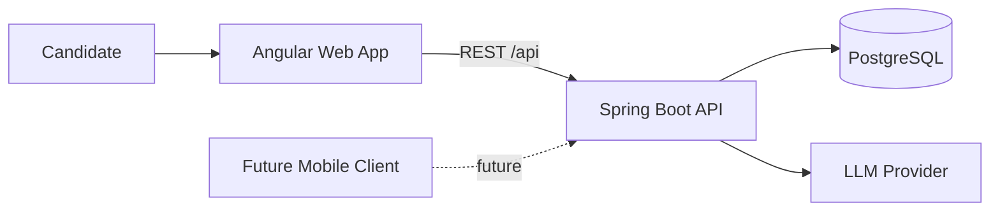

# RoleDock — System Overview

## System context

The Angular-to-Spring Boot-to-PostgreSQL path is the current technical
foundation. An experimental [job-offer extraction boundary](job-offer-extraction.md)
now connects the backend to an optional LLM provider without persistence or matching.
The mobile client is a possible future consumer, not an MVP component.

## Current components

### Angular web application

Owns presentation and user interaction. It collects user input, presents
results, manages screen-level state, and calls the backend through the REST API.

### Spring Boot backend

Owns the REST API, domain rules, persistence orchestration, compatibility
scoring, and AI integration. The extraction spike is the first provider integration.

### PostgreSQL

Stores persistent RoleDock data. Liquibase versions every schema change.

### LLM provider

Used by the extraction spike for structured interpretation of advertisement text.
It is an external assistant to the workflow, not a system of record or rule
engine.

## Architectural boundaries

- The UI does not own scoring rules.
- The LLM does not own candidate truth.
- The LLM does not own the final compatibility score.
- PostgreSQL schema changes are versioned by Liquibase.
- The backend API should remain client-agnostic so a future mobile application
  can consume it.

## Current deployment status

RoleDock supports local development only. No hypothetical cloud architecture is
currently a decided part of the system.
